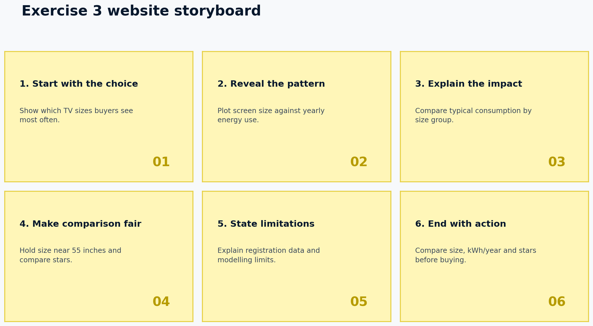

# Energy Consumption Website — Exercise 3

This website communicates a data story about television screen size, labelled annual energy consumption and energy star ratings in the Australian market. It extends the three-page website created for Exercise 0.2.

## Website pages

- `index.html` — appliance energy information, FAQ accordion and energy calculator
- `televisions.html` — Exercise 3 television energy data story and visualisations
- `about.html` — project purpose, author and AI acknowledgement

## Data Story

### Audience

The primary audience is Australian household consumers choosing a new television. They are likely to understand familiar product characteristics such as screen size but may not know how to interpret annual kilowatt-hours, correlations or differences between energy ratings.

### What the audience wants to know

1. Which television sizes are most commonly available?
2. Does choosing a larger screen usually increase energy consumption?
3. Can buyers find a more efficient television without changing their preferred size?
4. Which values on the energy label should buyers compare?

### Visualisation guidelines

- Use direct chart titles that communicate the main finding.
- Convert screen sizes from centimetres to familiar inches.
- Keep one main message in each chart.
- Use navy and yellow consistently with the website and power logo.
- Highlight only important categories to guide attention.
- Explain technical terms such as correlation in plain language.
- State filters, units and limitations near the visualisations.
- End with a practical action rather than only reporting statistics.

### Story structure

The story begins with the sizes consumers see most often, reveals the relationship between size and energy use, and then controls for size by comparing energy ratings among approximately 55-inch televisions. It finishes with an actionable recommendation: choose an appropriate size, then compare both the star rating and labelled kWh/year.



## About the data

### Data source

The analysis uses `tv_2026_02_15.csv`, a course-supplied extract of television registrations containing 4,724 records and 32 variables. Fields include registered brand, model number, countries sold in, screen size, screen technology, average-mode power, star rating and labelled energy consumption. The records refer to products registered under the Australian television energy-labelling framework.

### Data processing

The analysis was completed using Python and can be reproduced with `analysis/create_visualisations.py`.

1. Read all 4,724 source rows.
2. Retain products whose `SoldIn` field includes Australia.
3. Retain records marked `Approved` and `Available`.
4. Remove rows missing a selected numeric measure.
5. Analyse the resulting 4,508 records.
6. Convert `screensize` from centimetres to inches by dividing by 2.54.
7. Round inches to create the size-frequency chart.
8. Calculate Pearson correlation between screen size and labelled kWh/year.
9. Use medians for grouped comparisons because they are less affected by extreme values.
10. Restrict the star-rating comparison to models between 54 and 56 inches and remove rating groups with fewer than five models.

The main calculated results are stored in `analysis/analysis-summary.csv`.

### Privacy

The dataset describes registered television products and contains no names, contact details or other personal information. Therefore, the analysis creates minimal privacy risk.

### Accuracy and limitations

- Registration records describe models available in the market; they do not show sales volume or which televisions are most popular with buyers.
- Labelled energy consumption is based on a standardised test and may differ from energy used in an individual household.
- Screen size is associated with energy use, but correlation does not prove that size alone causes consumption differences.
- Product features, brightness, display technology and test conditions may also influence consumption.
- Brand names use inconsistent capitalisation, such as `Kogan`, `KOGAN` and `kogan`, which can distort brand-level summaries.
- Similar model numbers and product families may create registrations that are not fully independent.
- Counts can change as products enter or leave the market after the dataset extraction date.

### Ethics

The visualisations are designed to help consumers rather than promote or criticise a particular manufacturer. The story avoids a brand ranking because a fair comparison would need to control for each brand's mixture of sizes, features, technologies and duplicate registrations. The page states its filters and limitations so the audience is less likely to interpret association as causation or registered availability as sales popularity.

## Visualisation choices

- **Horizontal bar chart:** ranks common screen sizes and supports accurate comparison of model counts.
- **Scatter plot:** retains each television as an observation and reveals the strength, spread and exceptions in the size–energy relationship.
- **Bar chart of medians:** compares star-rating groups for similarly sized televisions while reducing the effect of outliers.
- **Metric strip:** summarises median consumption by size group to make the practical increase easy to scan.

## Folder structure

```text
appliance-energy-website/
├── index.html
├── televisions.html
├── about.html
├── README.md
├── analysis/
│   ├── create_visualisations.py
│   └── analysis-summary.csv
└── assets/
    ├── css/style.css
    ├── js/script.js
    ├── data/tv_2026_02_15.csv
    └── img/
        ├── power-icon.svg
        ├── common-tv-sizes.png
        ├── size-vs-energy.png
        ├── star-rating-55-inch.png
        └── storyboard.png
```

## Running the website

Open `index.html` in a browser. The website does not require installation or external JavaScript libraries.

## Suggested Git commits

```text
Reuse Exercise 0.2 website structure for data story
Add TV dataset filtering and analysis script
Create screen size frequency visualisation
Add screen size and energy scatter plot
Compare star ratings for 55-inch televisions
Write data story content and audience guidance
Document data limitations, ethics and AI declaration
Improve responsive chart layout and accessibility
```

## AI Declaration

I used ChatGPT to assist with planning the data-story structure, analysing the supplied CSV file, drafting Python chart code, suggesting accessible chart descriptions, and producing an initial draft of the webpage and README text.

I reviewed and adapted the generated work by selecting the audience, checking the dataset filters, verifying the formulas and calculated values, refining the chart sequence, and ensuring the conclusions did not claim that correlation proves causation. I also checked that the visualisations use clear units and that limitations and ethical considerations are stated.

Generative AI accelerated the initial structure and helped identify useful comparisons, particularly controlling for screen size when comparing star ratings. Its limitations were that it required the actual dataset to produce reliable findings, and all automatically generated calculations, wording and code still needed human checking. I remain responsible for understanding and explaining the submitted work.

## Author

Naweed Ahmed
